# Demo the Understand Phase using the Application Discovery Tool on IBM watsonx Code Assistant for Z 
1. In Z Virtual Access, click IBM Developer for z/OS **(A)** in the taskbar to open it.
   
   
   It may take a minute for the application to open, but you will soon see the splash screen.
   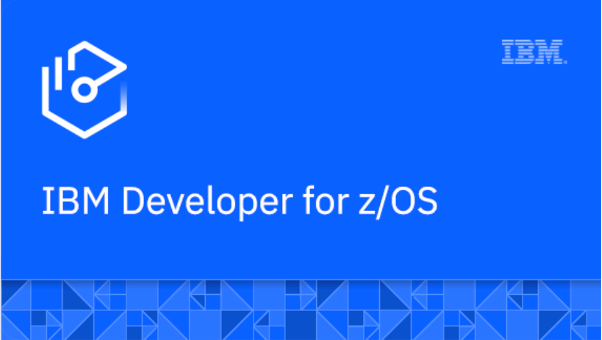

   The IBM Developer for z/OS Integrated Developer Environment (IDE) opens displaying the **Explore projects** tab **(A)**.
   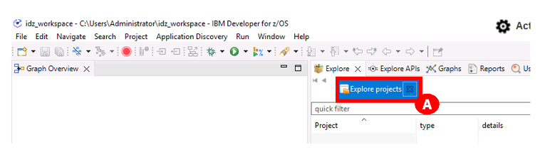

2. Right-click below the quick filter area (A), and click **Get project list** **(B)**.
   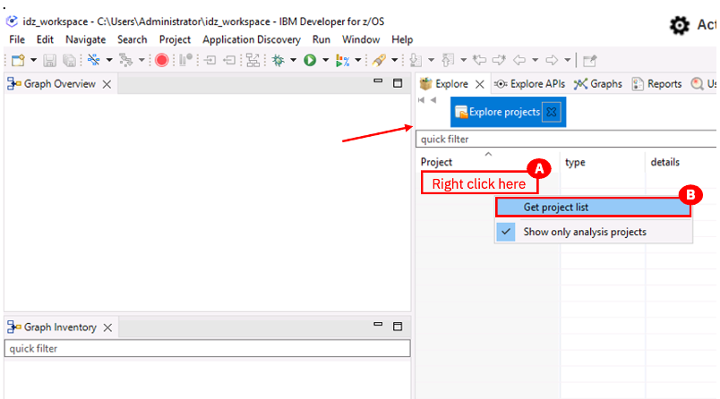

3. Click **GenApp** **(A)** in the **Project** list.
   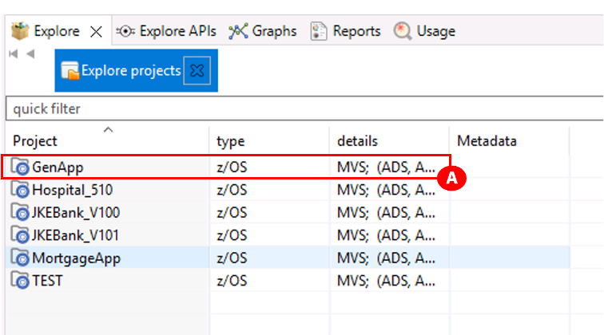
   A new field with a list of options appears on the right side of the screen.

4. From the quick filter box **(A)**, expand the **Mainframe Graphs** twistie **(B)**, and double-click **Transaction Callgraph** **(C)**.
   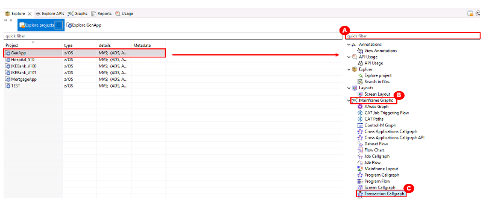

5. It may take a moment for the **GenApp – Transaction Call Graph Analysis** pop-up that is needed to do the next step to appear.
   You will see an **executing Transaction Callgraph** message at the bottom of the pop-up displaying a green progress bar **(A)**.
   Select everything in the **Available transactions** box using the **add all items** button (looks like a fast forward button) **(B)**, and move them to the **Selected transactions** box.
   Then click **Finish** **(C)** to load the transactions.
   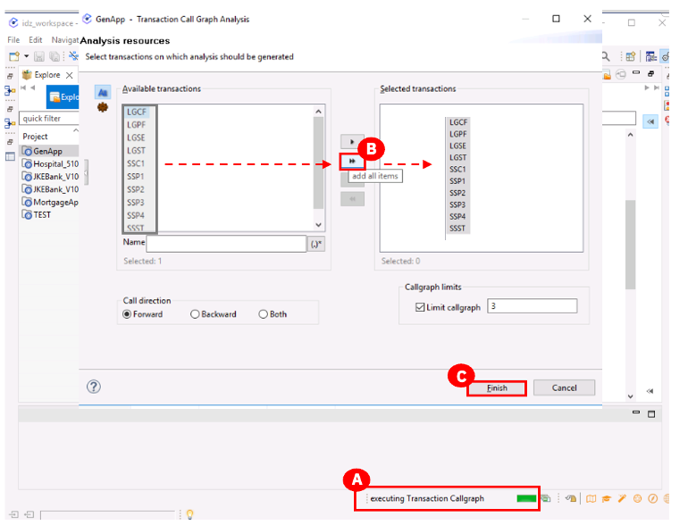
   A call graph is loaded with all the transactions in this profiled application. (Note: it may take a few minutes for the graph to build.)
   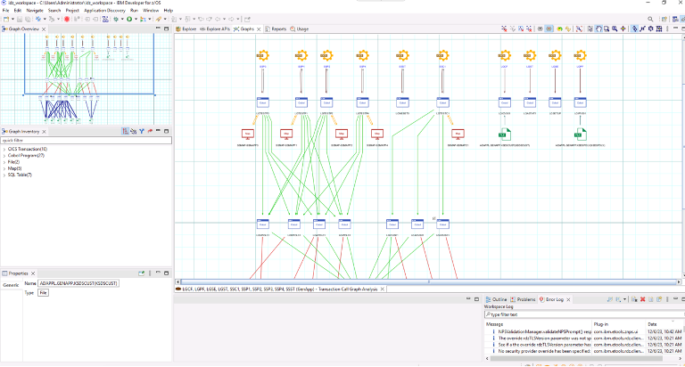

6. Zoom in so you can see the transaction named **SSC1** (A). This transaction is related to the CUSTOMER table. The SSC1 transaction is used to add, insert, and update the CUSTOMER table. SSC1 is used in the next phase of this demo.
   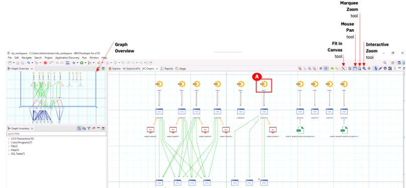
   **Note**: There are some tools in the upper right corner of the graph view to help you navigate and zoom.
   
   - Use the **Mouse Pan Tool** to move to different areas of the graph. Click the **Mouse Pan tool** (the icon looks like a hand) in the top right and drag the hand icon around the graph to pan to different areas.
   - Use the **Interactive Zoom Tool** to zoom in and out of the graph. Click the **Interactive Zoom Tool** (the icon looks like a magnifying glass with an arrow inside it). Click and hold on an area on the graph and if you drag your cursor downwards, this will zoom in to the graph. Click and hold on an area on the graph and and if you drag your cursor upwards, this will zoom out of the graph.
   - Use the **Marquee Zoom Tool** to zoom into a specific area. Click **Marquee Zoom tool** (the icon looks like a magnifying glass) in the top right and drag your cursor to draw a box around a specific area on the graph. Once you release your cursor, the graph will be zoomed into that area.
   - Use the **Fit in Canvas Tool** (the icon looks like a magnifying glass with red corners) to zoom the graph back out to full view. 
   - As you use these tools, the **Graph Overview** window in the upper left allows you to see where you are in the graph and will highlight the area with a blue box.

7. Select the **Explore** tab (A) to return to the view shown in Step 4 where a list of options appears on the right side of the screen under the **quick filter** box. 
   In this new field, expand the **Mainframe Graphs** twistie **(B)** and double-click the **Transaction Callgraph** option **(A)**.
   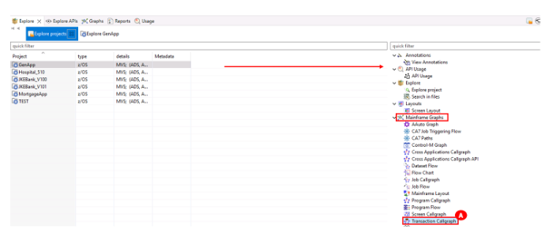
   It may take a moment for the pop-up needed to do the next step to open. You will see **executing Transaction Callgraph** at the bottom with a green progress bar.
   
8. This time (unlike in Step 7), select only the **SSC1** transaction (A), and this time use the **add selected items** icon (it looks like a play button) (B) to just add this one transaction to the **Selected transactions** box on the right. Then click **Finish** (C).
   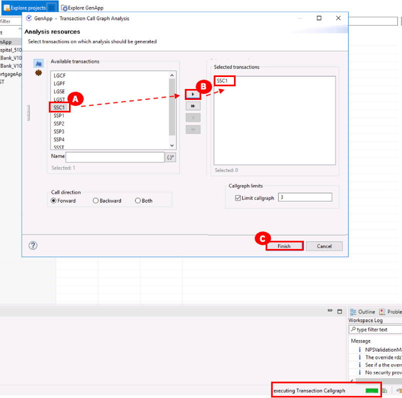
   The SSCI transaction graph begins loading. (This may take a minute to load, you will see Loading graph message in the middle of the screen).
   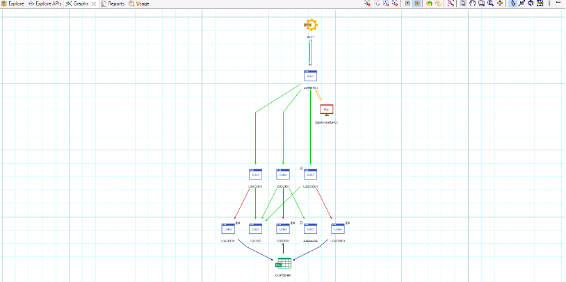
   A transaction callgraph has different components. (Use the pan and zoom tools detailed earlier to look more closely at these components). For example:
   1. The SSCI’s CICS transactions 
   2. The main transaction program (LGTESTC1). This program calls the SSMAPC1 map.
   3. Depending on the function selected, it can perform different operations. In this example:
      - Add/Insert Customer (LGACUS01)
      - Inquire Customer (LGICUS01)
      - Update Customer (LGUCUS01)
      - Writes messages back to the user (LGSTSQ)
      - Unknown program with no source code information (AAAAAAAA)

   4. These programs call data access programs that interact with the table CUSTOMER. For example:
      - Add/Insert Customer (LGACDB01)
      - Inquire Customer (LGICDB01)
      - Update Customer (LGUCDB01)
      - Writes messages back to the user (LGSTSQ)
      - Unknown program with no source code information (AAAAAAAA)

9.	Double-click on the **COBOL LGACDB01** white and blue box (A). The code opens at the bottom (B).
   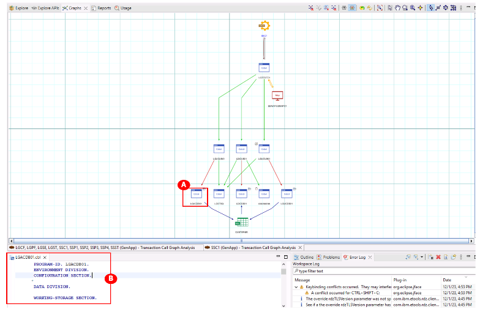
10.	Drag the **LGACDB01** code tab at the bottom, to the right side of the graph (A) in step 9 (before you release your button, you will see guardrails where this window will be placed) so you can see the code beside the navigation view.
   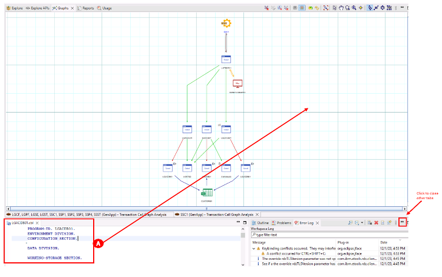
   **Note**: Close all open tabs other than the tabs with the graph and code. The other tabs can be closed via the minimize icon (looks like –) in the top right of each window.
11.	In the LGACDB01.cbl code, scroll down to the **INSERT-CUSTOMER** section (A), the main function is to insert a record into the CUSTOMER table.
   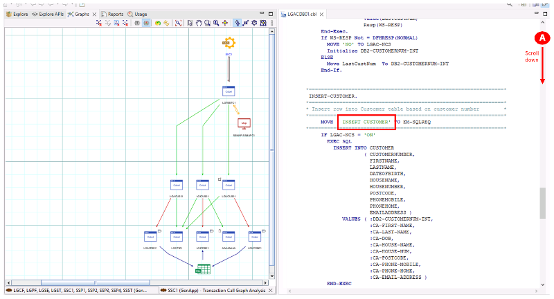

