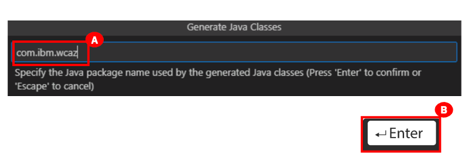

# How to execute the Transform phase using Visual Studio Code
1. Click the Microsoft Windows **Start** button **(A)** (the Windows logo in the bottom-left corner of the demo screen), and click **Visual Studio Code** **(B)**.
    
2. Expand the **New: IBM watsonx Code Assistant for Z in Z Open Editor** twistie, and select **Enable the IBM watsonx Code Assistant for Z integration with Z Open Editor (requires an account)** checkbox.
   
3. Close the **Welcome to Z Open Editor** window by clicking the **X (A)** at the top of the tab’s name.
   
4. In the **EXPLORER** panel on the left, ensure that the **NAZARE-DEMO-CICS-GENAPP (WORKSPACE)** twistie is collapsed **(A)** (you may not need to do this depending on your screen size), and then expand **IBM WATSONX CODE ASSISTANT FOR Z (B)**.
   
5. You will see a warning that Visual Studio Code is missing an API key. Click the **Missing watsonx API key** warning **(A)** (the yellow text).
   
6. The **Enter watsonx API key (Press ‘Enter’ to confirm or ‘Escape’ to cancel)** box appears at the top of the IDE - Visual Studio Code screen. Enter `ABCDEFGH` **(A)**, and press the Enter key **(B)**.
   
   **Note**: `ABCDEFGH` is a fake API key only for this demo. In a real environment, a real API key must be used.
7. In the **EXPLORER** panel on the left, expand the **NAZARE-DEMO-CICS-GENAPP (WORKSPACE)** twistie (A), and click **LGACDB01.cbl** **(B)**. A new tab opens to the right displaying the COBOL code.
   
8. In the **EXPLORER** panel on the left, right-click **LGACDB01.cbl** **(A)**, and click on **Import COBOL program (B)**.
   
   **Note**: The COBOL program is imported to **IBM WATSONX CODE ASSISTANT FOR Z** as **base\LGACDB01.cbl**. You might have to collapse the **NAZARE-DEMO-CICS-GENAPP (WORKSPACE)** twistie.
9. In the **EXPLORER** panel, under **IBM WATSONX CODE ASSISTANT FOR Z**, expand the **base\LGACDB01.cbl** twistie **(A)**.
    
    You will see two entries:
    - Generate Java Identifiers
    - Generate Java Methods
10. Click **Generate Java Identifiers (A)**. A **Generate Java Classes** input bar appears at the top middle of the IDE - Visual Studio Code screen.
    
11. Enter `java` **(A)**, and press Enter **(B)**.
    
12. A new input bar opens in the same location. Enter `com.ibm.wcaz` **(A)**, and press Enter **(B)**.
    
13. A new **Java identifiers** tab appears on the right-hand side of the window.
    
14. Click the twistie to expand the **LGACDB01** artifact **(A)**. You can see the variables that are used in the LGACDB01 artifact.
15. Click the twistie to expand the **CUSTOMER** artifact **(B)**. You can see the variables that are used in the CUSTOMER artifact.
    
16. At the right bottom of the **Java Identifiers** tab, click **Generate Java classes (A)**.
    
17. In the **EXPLORER** panel, return to the **NAZARE-DEMO-CICS-GENAPP (WORKSPACE)** project **(A)**.
    
18. Double-click **Customer.java** class **(A)** to open it. Customer.java opens in a new tab. (You might have to scroll to see all of the code.)
    
    In the Customer.java class, you can see the getter, setters, and variable overrides.
    
19. In the **EXPLORER** panel, return to the **NAZARE-DEMO-CICS-GENAPP (WORKSPACE)** project, and double-click **CustomerRequest.java (A)** to open it.
    
20. CustomerRequest.java opens in a new tab. (You might have to scroll to see all of the code.) At the bottom of CustomerRequest.java, hover over the insertCustomer method name (A). The cursor will change to a hand tool.
