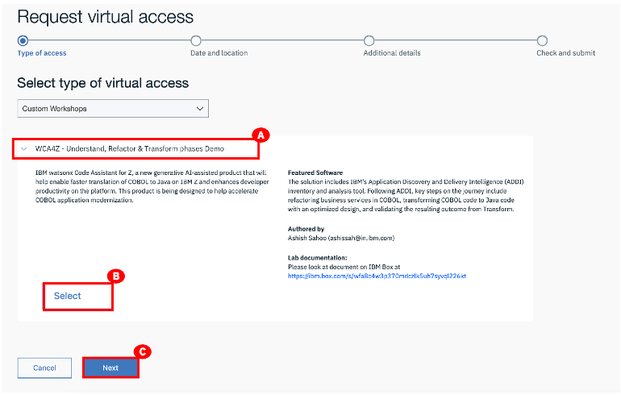

# Reserve the demo environment

Demo reservations should be submitted 2 days in advance of when you require the environment. The reservation can be accessible for up to 4 days.

1. Go <a href="https://zva.wdc1a.cirrus.ibm.com/workshoptemplate?id=a354090dd4e46f36a71e90eacf7abd12" target="_blank">this link</a> to reserve your demo environment.
2. Click **WCA4Z – Understand, Refactor & Transform phases Demo** to expand the section.
3. Click **Select**.
4. Click **Next**.
   

**IBM Business Partners** 
Contact your IBM Business Partner Representative for environment access. 
