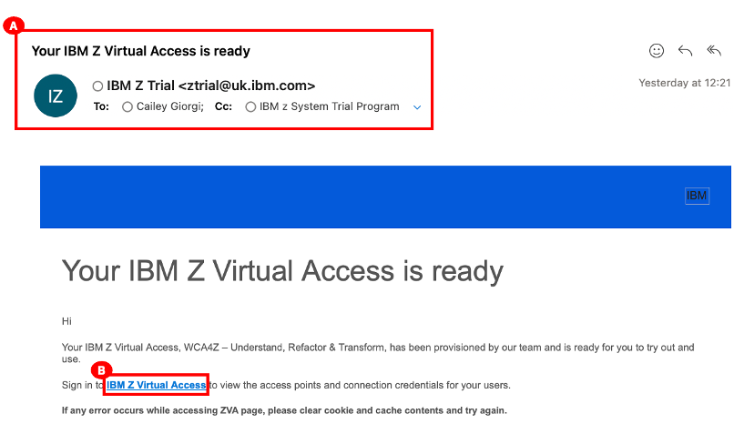
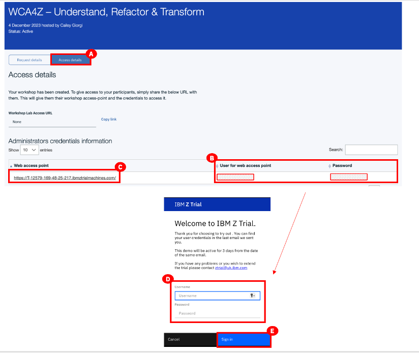

# Logging into Z Virtual Access

When your IBM Z Virtual Access (zVA) reservation is ready you will receive an email from IBM Z Trail (ztrail@uk.ibm.com) (A) with a link to sign in to zVA.

1. From the email, click the link to sign in to IBM Z Virtual Access.
   
2. Click **Access details** (A in the image below).
3. Take note of the **User for web access point** and **Password** (B).
4. click **Web access point box** (C). The IBM Z Trail login window opens.
5. Enter the **User for web access point** and **Password** values (from the previous screen) into **Username** and **Password** (D).
6. Click **Sign in** (E).
   
   A Windows virtual machine (VM) opens and takes you to an IBM Application Discovery and Delivery Intelligence page to allow you to use the IBM watsonx Code Assistant for Z tools.