# How to run the Refactor phase using IBM watsonx Code Assistant for Z Refactoring Assistant

1. Open the PuTTy app from the taskbar at the bottom **(A)** of the demo window. It may take a few minutes to open.
   
2. Select **wca4z-ra** from the **Saved Sessions** box **(A)**, and click **Open** **(B)**.
   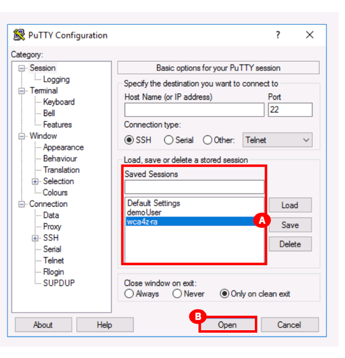
3. After clicking **Open** in the previous step the following warning message will pop-up. Click **Accept** **(A)**. This warning will only be displayed one time if you do this demo again.
   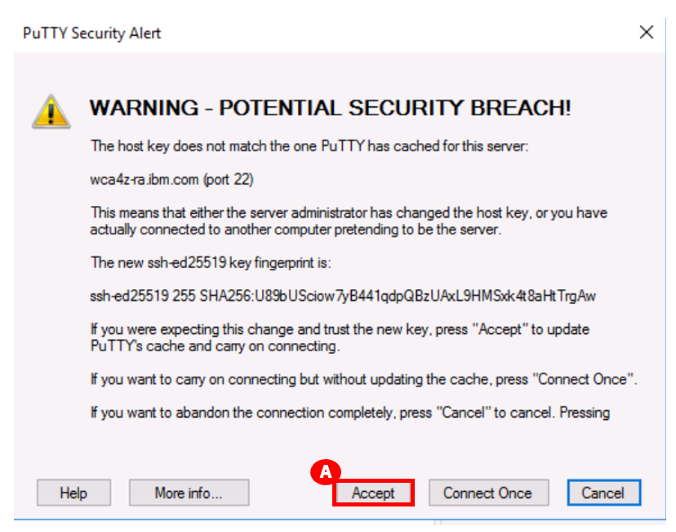
4. A script will run in PuTTy to start the Refactoring Assistant. When you see the text **IBM Watson code assistant for Z Refactoring Assistant started** **(A)** at the bottom of the PuTTy window, you can close the PuTTy window by clicking the **X** **(B)** in the top-right corner. You will be asked **Are you sure you want to close the session?**. Click **OK** **(C)**.
   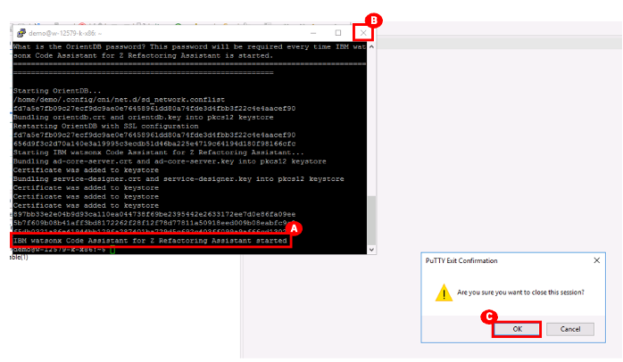
5. Click the Firefox icon **(A)** in the taskbar of the demo window to open it. It may take a few minutes to open.
   
6. Click the IBM watsonx Code Assistant for Z Refactoring Assistant link in the Favorites bar at the top or click **wca4z-ra.ibm** below the Firefox search bar **(A)**.
   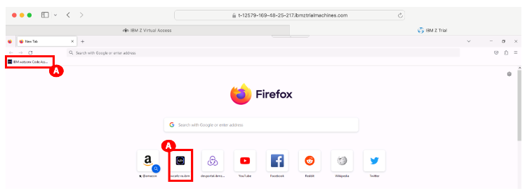
7. Login with the following credentials, and click **Log in** **(C)** to proceed to the IBM watsonx Code Assistant for Z Refactoring Assistant:
   - Email address: dev@wca4z-ra.ibm.com **(A)**
   - Password: password **(B)**
  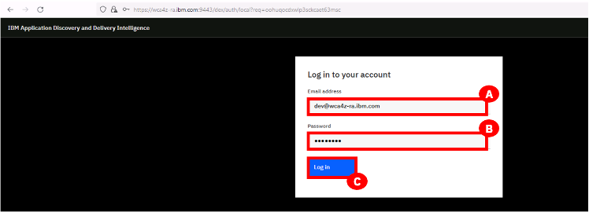
8. After logging in, you will see following tabs:
    - My workspaces **(A)** (the default)
    - Workspaces shared with me **(B)**
  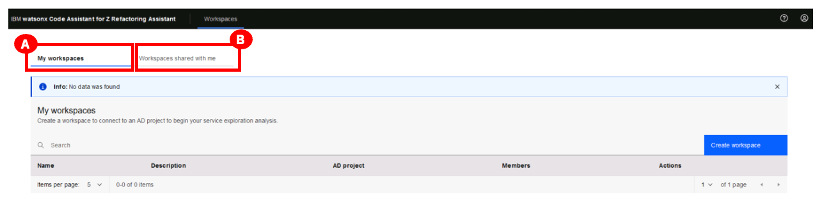
  After building a project in the Understand phase, you can create a workspace to work on that project with IBM watsonx Code Assistant for Z Refactoring Assistant.
9. In the **My workspaces** tab, click **Create workspace** on the right (A).
    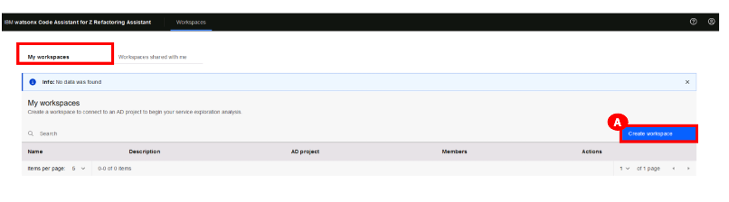
10. In the **Create workspace** dialog box:
    - Type a name for the workspace that you want to create. For example: **WCA4Z-DEM-WS** **(A)**.
    - Optionally, add a description in the **Description** box **(B)**. For example: **Workspace for WCA4Z for GenApp application**.
    - Click the **AD Project** dropdown list, and select the project that you built with the IBM Application Discovery (AD) Build Client. In this lab, select **GenApp** **(C)**. 
    - Click **Create** (D) to create the workspace.
    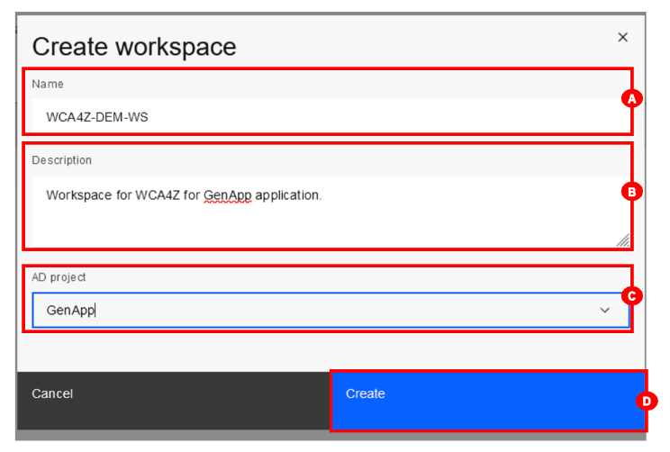
11. The GenApp workspace’s **Graph** tab **(A)** is displayed. Click in the **Search** bar **(B)** at the top. You will see the **Artifact type** drop-down menu.
    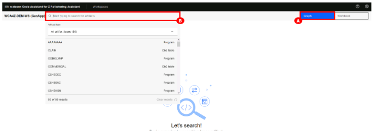
12. Select **All artifact types** (it’s likely the default) to see a dropdown list of the different artifact types **(A)**.
13. Select **CICS transactions (B)**.
    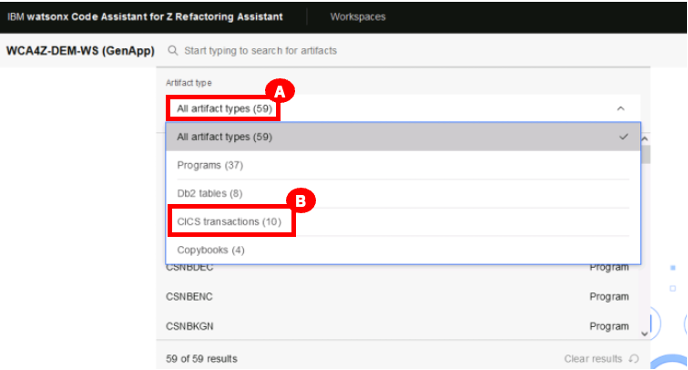
14. From the dropdown list of transactions, double-click the **SSC1** artifact **(A)** to open it.
    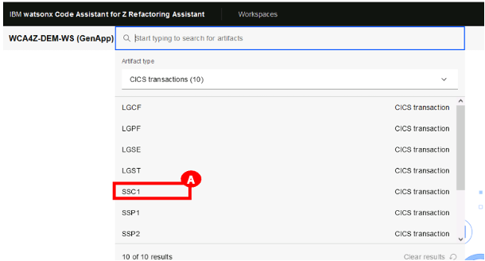
15. The **SSC1** transaction graph opens. **Zoom out by 10%** (A) using the magnifying glass icon (bottom left) until you can see the complete callgraph in the window.
    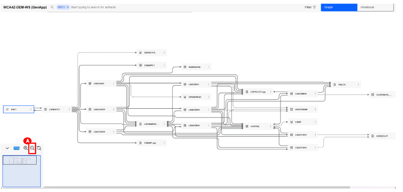
16. The entire graph should be displayed after zooming out. Locate and click on the **CUSTOMER (A)** table to highlight the flow of program dependencies for this table.
    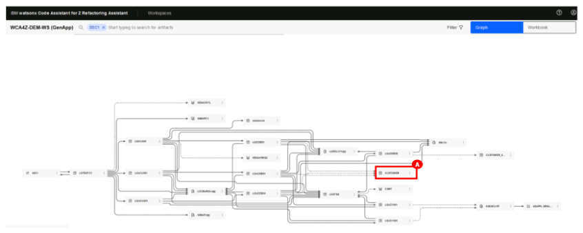
17. In the Understand phase, you checked the callgraph for SSC1 transactions and then looked at the **INSERT-CUSTOMER** query in the LGACDB01 code.
    
    Now click the ellipsis icon (3 dots) beside **LGACDB01 (A)**. You are presented with the following actions **(B)**:
    - View properties
    - Identify conditional statements.
    - Identify paragraphs. 
    - Identify tables/file access statements. 

18. Select **Identify conditional statements** **(C)** to display all conditional statements in the code in the order of importance/complexity.
    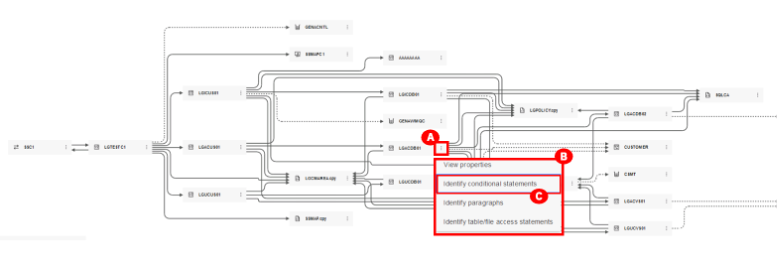
19. The screen will switch to **Workbook** tab **(A)** that displays the key conditional statements in the code in the order of importance/complexity (B).
    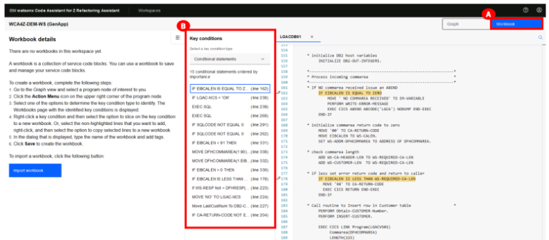
20. Select the **Graph** tab **(A)** on the top right to return to the **Graph** tab (that’s where you were in steps 17/18).
    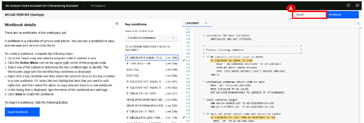
21. Repeat the same thing you did in Steps 17/18, only this time select **Identify paragraphs (C)**.
    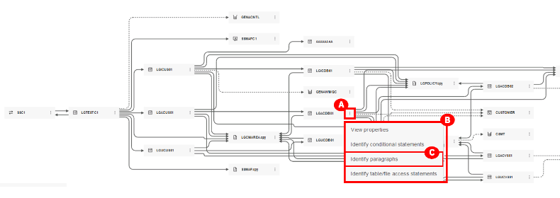
22. The screen will switch to the **Workbook** tab with a paragraph identification form.
    You will see 3 sections:
    - **Workbook details (A)** on the left.
    - **Paragraphs in the code (B)**, in the order of importance/complexity, in the middle section.
    - The **artifact’s code (C)** in the right section.
  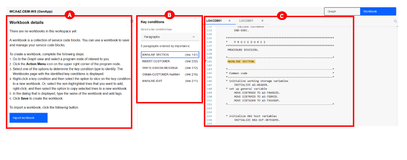
1.  Click **INSERT-CUSTOMER (A)** in the **Key conditions** box where **Select a key condition type** drop-down is set to **Paragraphs** to jump to this code on the right.
    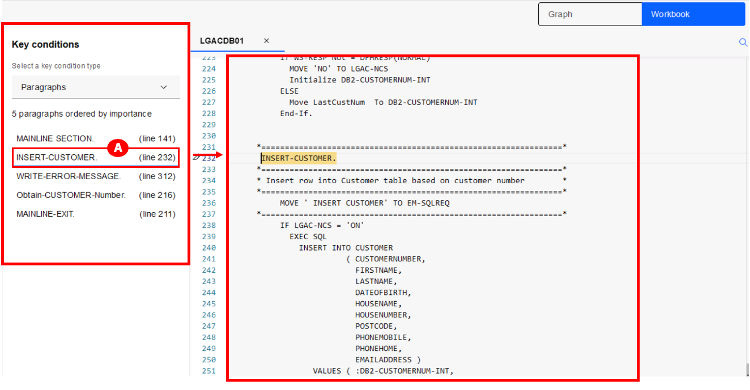
2.  For Windows users: Click the **INSERT-CUSTOMER** text (line 232) in the code, then right-click **(A)** to see the **Slice on paragraph to new workbook** option. Double-click **Slice on paragraph to new workbook** **(B)**.
    
    For Mac users: Click the **INSERT-CUSTOMER** text (line 232) in the code, then right-click **(A)** to see the **Slice on paragraph to new workbook** option. Click **Slice on paragraph to new workbook** **(B)**.
    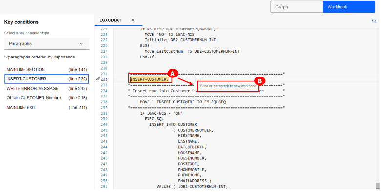
    > **NOTE**: Mac users: When you right-click, if the **Slice on paragraph to new workbook** option does not appear, please update your Mac Systems Settings by clicking the Mac apple icon from your top toolbar > select **System Settings** > **Trackpad**. In your Trackpad preferences, update your **Secondary click** to **Click in Bottom Right Corner**. Then hover over **INSERT-CUSTOMER** and click the bottom-right corner of your trackpad to see the **Slice on paragraph to new workbook** option.
3.  The **Slice to a new workbook** pop-up window will appear. Enter **LGACDB01 (A)** in the **Workbook name** field, and click **Save (B)**.
    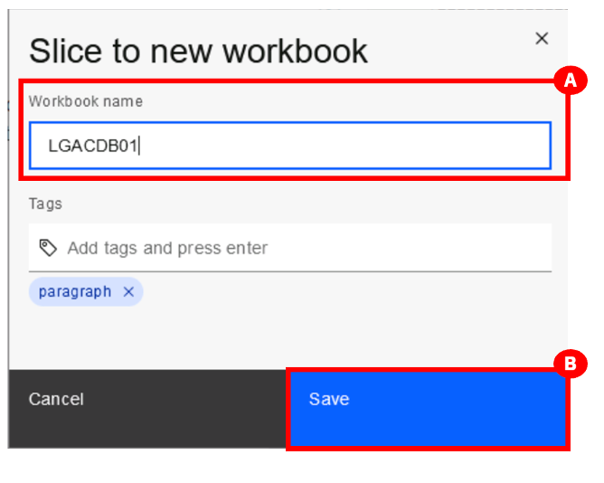
4.  The selected paragraph of code will be sliced into a new workbook (called **LGACDB01**) and displayed on the left **(A)**. Note how the selected code is marked with a dotted blue line in the code editor on the right **(B)**.
    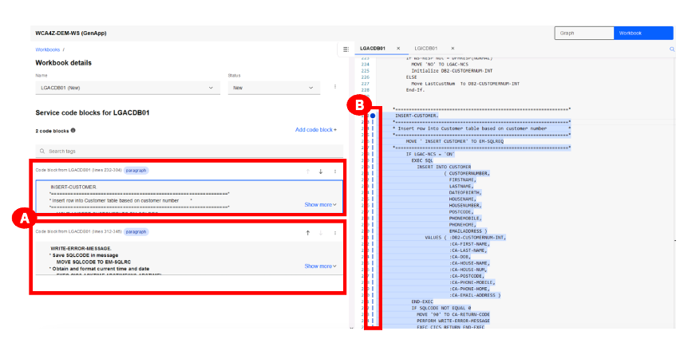
5.  In the **Workbook details** section, click the ellipsis icon (3 dots) beside **Status (A)**.
6.  Select the **Export** option to export the sliced code **(B)**. An **Export workbox LGACDB01** window will appear. Click **Save (C)**.
    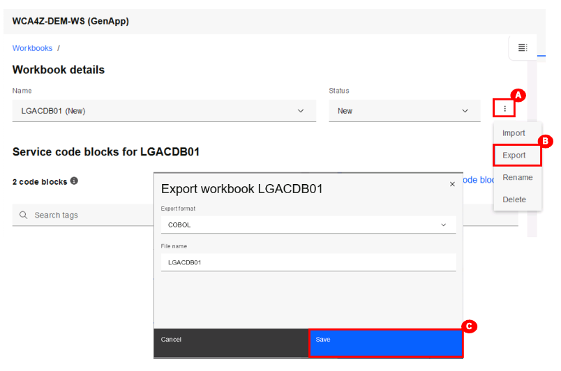
7.  A pop-up window will appear with a default location to save the exported sliced code. Click **Desktop** on the left **(A)** and navigate to the following: **Desktop\WCAZ Lab Data\nazare-demo-cics-genapp\base\src\cobol (B)**. Then click **Save (C)** to save the exported code.
    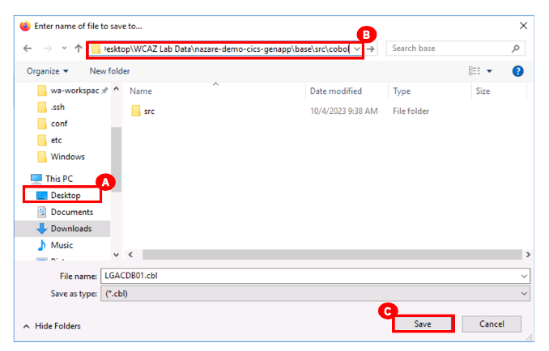